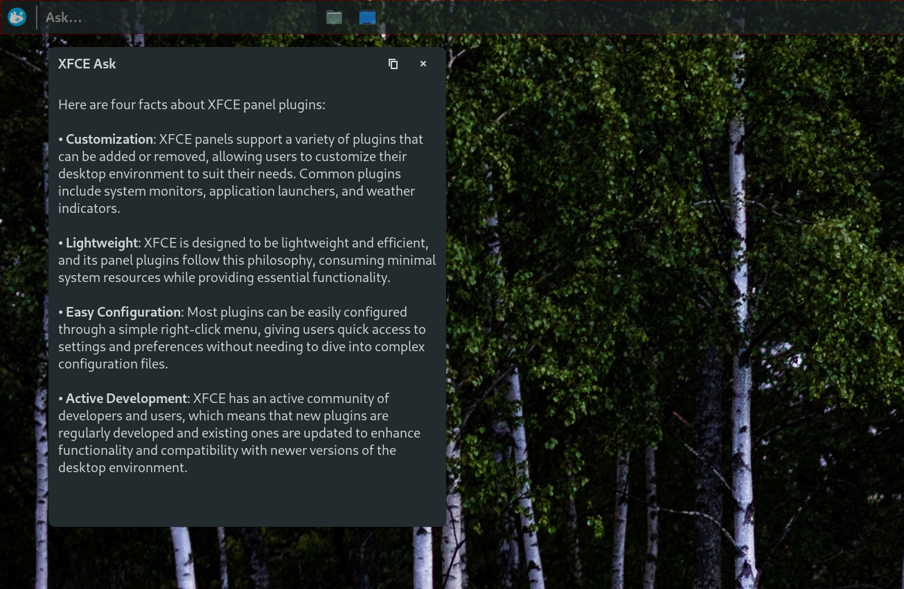

# XFCE Ask (XFCE panel plugin)



A small XFCE panel plugin for quick one-off questions to any OpenAI-compatible Chat Completions endpoint. Type a question in the panel entry and press Enter; the answer shows in a GTK popover.

Works with any OpenAI-compatible endpoint, including local/self-hosted ones. If your endpoint does not require auth, leave the API key blank.

License: MIT (see `LICENSE`).

## Behavior

- `Enter`: send the current prompt.
- Follow-ups are state-based: if the popover is still open, the next `Enter` is treated as a follow-up (limited context is kept); closing the popover ends the session.

## Build

Dependencies (dev headers): `gtk3`, `libxfce4panel`, `libsoup-3`, `json-glib`, `libsecret`.

### Make

```sh
make
```

## Install (local)

### Make

```sh
sudo make install
xfce4-panel -r
```

## AUR

If you use Arch Linux or a derivative thereof use:

- AUR package: https://aur.archlinux.org/packages/xfce4-panel-xfce-ask-git

## Configure

Right-click the plugin → Properties:

- Endpoint: e.g. `https://api.openai.com/v1/chat/completions`
- Model: e.g. `gpt-4o-mini`
- Temperature
- API key: stored in the system keyring (per-endpoint)

## Debugging

The plugin writes a debug log to:

- `~/.cache/openai-ask/openai-ask.log`

Logging is disabled by default. Enable it by starting your session/panel with `XFCE_ASK_DEBUG=1`.

Tail it while testing:

```sh
tail -f ~/.cache/openai-ask/openai-ask.log
```
